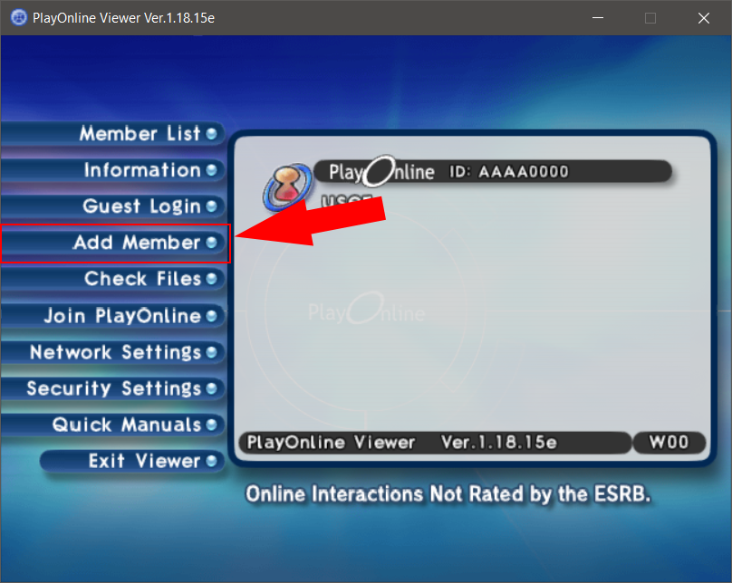
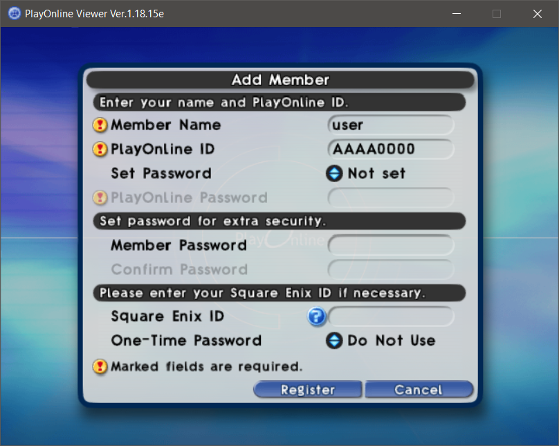
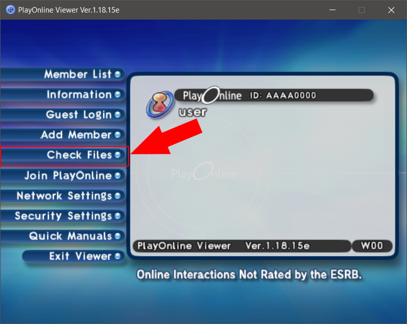
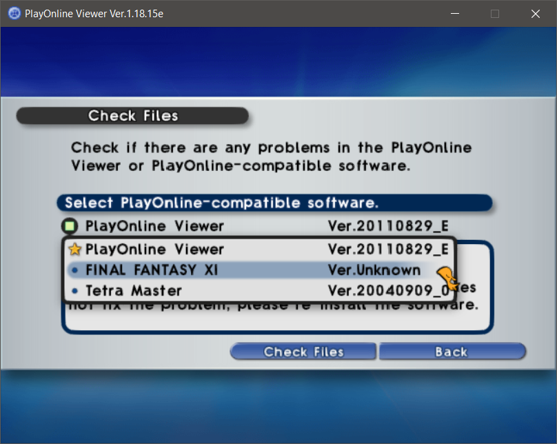
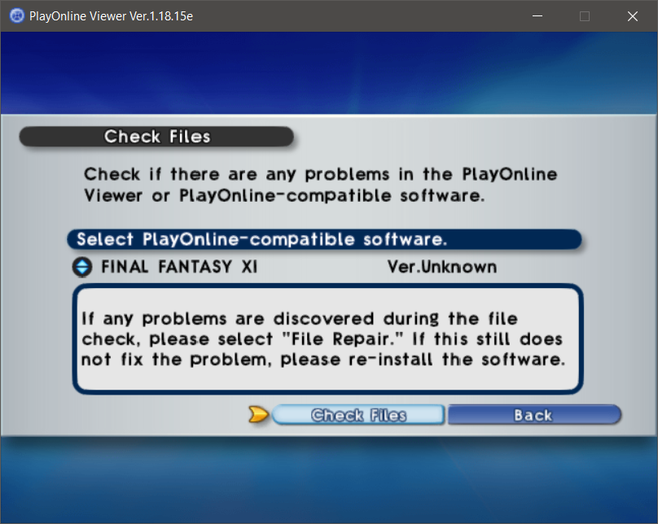

# Server

We have a server running for FINAL FANTASY XI.
The server in use is [LandSandBoat](https://github.com/LandSandBoat/server)

If you would like to use the server we have running, follow these instructions.

## Client Setup

### PlayOnline and FINAL FANTASY XI

1. Download the offical client from: http://www.playonline.com/ff11us/download/media/install_win.html
  - You will need all 5 parts that are listed here.
  - All of the files must be placed in the same directory.
2. Run `FFXIFullSetup_US.part1.exe` to start the install process.
3. Install **PlayOnline Viewer** and **FINAL FANTASY XI**.
  - The DirectX End-User Runtime is not required.

### Pre-Setup

1. Download [ffxi_force_patch.zip](https://raw.githubusercontent.com/silusffxi/server-setup/main/files/ffxi_force_patch.zip).
  - The password for this file can be found in the Discord.
2. Unzip the files into your FINAL FANTASY XI install directory, by default this should be `C:\Program Files (x86)\PlayOnline\SquareEnix\FINAL FANTASY XI`.

### PlayOnline Setup

1. Create a new user in PlayOnline:

2. Fill in the required information.
  - _Member Name_ can be anything. Something like "user" will work just fine.
  - _PlayOnline ID_ should look like a Content ID for FINAL FANTASY XI. This just needs to be 4 letters and 4 numbers.
    - For example: `AAAA0000`
  - _Set Password_ should be set to "Not set"
  - _Member Password_ can be left blank
  - _Square Enix ID_ can be left blank
  - _One-time Password_ should be set to "Do Not Use"

### Patch Client

You would normally need to take advantage of a trial account in order to get the latest version of the client. However, we can use the files that were applied in the _Pre-Setup_ step to force the update.

1. Go to "Check Files" in PlayOnline Viewer

2. Select "FINAL FANTASY XI Ver.Unknown" then select "Check Files"

Follow the prompts to verify the files. You will be prompted to fix files once the check completes. Let the client fix files.

You can either wait for the patching to complete or you can do the _Custom Launcher_ and _Windower_ steps while waiting for the patch to complete.

### Custom Launcher

In order to actually connect to the server, you will need to run a custom client. As long as you're using a compatible client it should work. However, it is recommended you use either the defacto launcher xiloader or a customized version of it "PayOffline.

- [xiloader](https://github.com/LandSandBoat/xiloader/releases/download/v1.0.6/xiloader.exe) ([source](https://github.com/LandSandBoat/xiloader))
- [PlayOffline](https://raw.githubusercontent.com/silusffxi/server-setup/main/files/playoffline_20220701.zip) ([source](https://gitlab.com/silusffxi/playoffline))

Once downloaded, place the client files in the **same directory** as `pol.exe`. By default, `pol.exe` is located in `C:\Program Files (x86)\PlayOnline\SquareEnix\FINAL FANTASY XI`.

### Windower

Download and install Windower: https://www.windower.net/
(Direct download: [windower.msi](https://update.windower.net/live/windower.msi))
